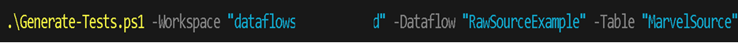

# Generating Tests

To generate a test set (feature plus step files), you can use the PowerShell script "Generate-DFTests.ps1". Generate-DFTests.ps1 builds a feature file based on a template for testing a dataflow (see image below).

Generate-DFTests.ps1 accepts a Workspace, Dataflow, and Table parameter and will double check the parameters are correct with the Power BI service.  Consequently, you may be prompted to sign into the Power BI Service.

