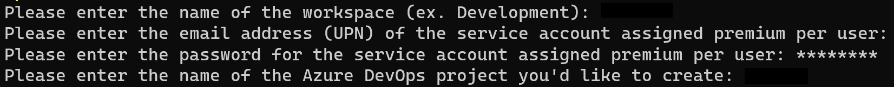

# pbi-dataops-dataflows-polling-method
Example of managing version control and testing of Gen1 Power BI dataflows without Bring Your Own Data Storage

> ***Important Note #1**: This guide is customized to Power BI for U.S. Commercial environment. If you are trying to set this up for another Microsoft cloud environment (like U.S. Gov Cloud), please check Microsoft's documentation for the appropriate URLs. They will be different from the U.S. Commercial environment.*

> ***Important Note #2**: This guide uses scripts that I built and tested on environments I have access to. Please review all scripts if you plan for production use, as you are ultimately response for the code that runs in your environment.*

## Table of Contents

1. [Prerequisites](#Prerequisites)
1. [Installation Steps](#Installation-Steps)
1. Version Control
    1. [Cloning the Project](./documentation/clone-project.md)
1. Testing
    1. [Building and Running Tests](./documentation/setup-testing.md)
    1. [Generating Tests](./documentation/generate-tests.md)

## Prerequisites

### Power BI
-   Power BI Premium Per User license assigned to a service account. If you do not have a Premium Per User license, use the "Buy Now" feature on <a href="https://docs.microsoft.com/en-us/power-bi/admin/service-premium-per-user-faq" target="_blank">Microsoft's site</a> or if you don't have access to do that, please contact your administrator (be nice!).

### Desktop

-  <a href="https://docs.microsoft.com/en-us/cli/azure/install-azure-cli" target="_blank">Azure CLI</a> installed with devops extension (az extension add --name azure-devops).

-  <a href="https://docs.microsoft.com/en-us/powershell/scripting/install/installing-powershell-on-windows?view=powershell-7.2" target="_blank">PowerShell Core</a>.

### Azure DevOps

-  Signed up for <a href="https://docs.microsoft.com/en-us/azure/devops/user-guide/sign-up-invite-teammates?view=azure-devops" target="_blank">Azure DevOps</a>.

- For Azure DevOps you must be a member of the Project Collection Administrators group, the Organization Owner, or have the Create new projects permission set to Allow. 

## Installation Steps

### Create Power BI Workspaces and Create Azure DevOps project
1. Open PowerShell Version 7 and enter the following script:
    > Invoke-WebRequest -Uri "https://raw.githubusercontent.com/kerski/pbi-dataops-dataflows-polling-method/main/Scripts/Setup/Setup-PPU.ps1" -OutFile "./Setup-PPU.ps1"

    ***Important Note #3**: You may need to run Unblock-File ./Setup-PPU.ps1 depending on your PowerShell execution policies.*
    
1. This will download the setup scripts to the current folder.  Run ".\Setup-PPU.ps1" in PowerShell.

1. During the install process you will be prompted to enter the following information:

    - The name of the development workspace you wish to create in the Power BI Service.
    - The name (UPN/email) of the Service account you created in the Prerequisites section.
    - The password for the (UPN/email).
    - The name of the project you wish to create in Azure DevOps.

    

1. During the course of the install you will be prompted to enter your Microsoft 365 credentials. Depending on your environment you may have a browser tab appear to sign-in. After signing in you can return to the PowerShell window. In addition, if you don't have the Power BI Management Shell or Azure DevOps CLI package installed, you will be asked to install.  Please affirm you wish to install those packages if prompted.

1. If the script runs successfully you will be presented with a message similar in the image below. 

    

## Next Steps

Now that installation steps are completed, please review and share the instructions for [Cloning the Project](./Documentation/clone-project.md)
